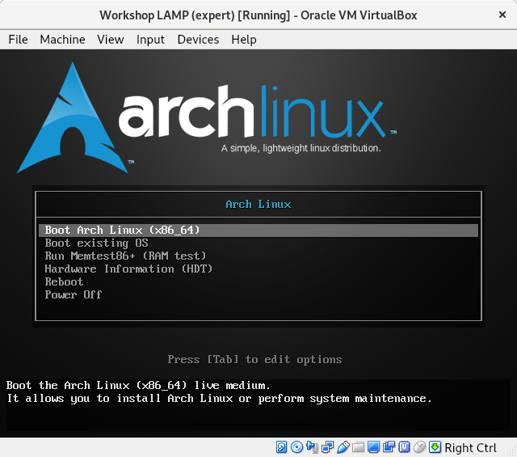
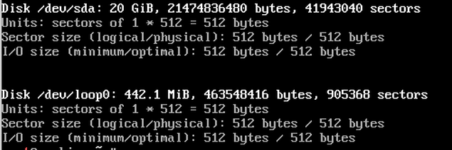

# Inhoudsopgave

1. Inleiding
2. Voorbereiding
	* Linux distributie downloaden
	* Aanmaken nieuwe virtuele machine
3. [Arch Linux](#Arch Linux)
	* Voorbereiding
	* Toestenbordindeling instellen
	* Controleren of we met het internet verbonden zijn
	* Klok goed zetten
	* Harde schijf voorbereiden
	* Installeren basis ArchLinux
	* Fstab genereren
	* Tijdzone instellen
	* Taal & Regio instellen
	* Initramfs
	* Wachtwoord instellen
	* Hostname instellen
	* Bootloader
	* Netwerk instellen
4. MariaDB
	* Installatie
	* Configuratie
	* Testdatabank aanmaken
5. PHP
	* Installatie
	* Configuratie
6. Apache
	* Installatie
	* Configuratie
	* Testpagina's toevoegen
7. Uitbreidingen
	* phpMyAdmin
	* SSH
	* SFTP server
	* VirtualBox GuestAdditions
	* Synchronisatie bestanden server via gedeelde map

# Inleiding

Tijdens deze workshop gaan we in VirtualBox een eenvoudige webserver installeren 
en configureren. Dit gaan we doen door een zogenaamde LAMP stack op te zetten. 
LAMP staat voor Linux – Apache – MariaDB – PHP. Deze vier technologieën gaan we 
stap voor stap installeren en configureren. Als einddoel hebben we dan een simpele
webserver opgezet in een virtuele omgeving.

Afspraken doorheen deze handleiding:
    
* namen van pakketten en belangrijke termen zijn weergegeven in het **vet**
* commando’s zijn weergeven in een kader met voorafgaande command prompt
* acties/selecties/muisklikken worden geplaatst tussen ' '
* toetsenaanslagen worden geplaatst tussen " ", b.v.:&nbsp;"ctrl + c"
* (deel)inhoud van bestanden is in blauw afgedrukt of met syntaxcoloring
* voor de eenvoud wordt alles met user **root** uitgewerkt. Er worden dus geen 
extra accounts gebruikt (zie **Workshop LAMP expert** voor zo een aanpak)

# Voorbereiding

## Linux distributie downloaden


Als Linux distributie kiezen we voor [**Arch Linux**](https://www.archlinux.org/).
 Deze wordt wegens *bleeding-edge* niet aangeraden voor server installaties maar
 we gebruiken deze omdat we ook de installatiestappen van Linux zelf willen bestuderen.
 Ook wordt deze distributie standaard geïnstalleerd zonder GUI. Download [hier]
(https://www.archlinux.org/download/) de laatste versie. Daarnaast heeft deze 
distributie ook een uitgebreide documentatie terug te vinden op [**ArchWiki**]
(https://wiki.archlinux.org/).

## Aanmaken nieuwe virtuele machine

Maak eerst een nieuw host-only network aan. Dit doe je door in **virtualbox** de 
'Host Network Manager' te openen. Kies nadien voor 'create' om een nieuwe adapter aan
 te maken. Stel de waarden in voor deze adapter zoals te zien hieronder.


Maak nu in VirtualBox een nieuwe machine aan met volgende parameters:

* Geheugen: 1024 MB
* Harde Schijf: 20 GB
* 2 Netwerk Adapters     
	* 1: NAT
	* 2: Host-Only (Kies bij 'name'  de aangemaakte netwerkadapter van hierboven)

# Arch Linux

## Voorbereiding

Start de virtuele machine en kies het ISO bestand van ArchLinux om op te starten.
U krijgt volgend scherm te zien



Aangezien we nog geen besturingssysteem geïnstalleerd hebben kiezen we voor 
'Boot Arch Linux (x86_64)'. Na laden van de installatie komen we in de commandprompt
 terecht en kunnen we starten met de voorbereiding van de installatie.

## Toestenbordindeling instellen

Aangezien standaard de US-indeling geladen wordt zal het toetsenbord dus ook in 
**qwerty** formaat staan. Om over te schakelen naar **azerty** laden we de juiste
 toetsenbord combinatie als volgt: 
   
```bash
root@archiso ~ # loadkeys be-latin1
```

## Controleren of we met het internet verbonden zijn

Tijdens en na de installatie zullen we pakketten moeten downloaden. Daarom moeten
 we zeker zijn dat we verbonden zijn met het internet. Om de verbinding te controleren
 voeren we een **ping** uit naar Google:

```bash
root@archiso ~ # ping www.google.be
```

Gebruik "ctrl + c" om het ping commando te stoppen na enkele gelukte pogingen.

Soms laat de netwerkconfiguratie niet toe om een adres te pingen. Het is dan ook 
steeds een goed idee om via **curl** de netwerktoegang te controleren:

```bash
root@archiso ~ # curl icanhazip.com
```

Als uitvoer van dat commando zou je het externe ip van jouw machine moeten zien
 verschijnen. Indien dat niet zo is heb je geen toegang tot het internet.

## Klok goed zetten	

De initiële waarde van de systeemklok is niet altijd accuraat. Om deze bij te
 stellen voeren we volgend commando uit:  

```bash
root@archiso ~ # timedatectl set-ntp true
```

## Harde schijf voorbereiden

Aangezien we een nieuw systeem installeren met een nieuwe harde schijf moeten we
 deze eerst partitioneren zodat we straks **Linux** op een partitie kunnen 
installeren. Om een overzicht te krijgen van de aanwezige harde schijven en hun 
partities voeren we volgend commando uit:

```bash
root@archiso ~ # fdisk -l
```

U zou een uitvoer gelijkaardig aan onderstaande schermafbeelding moeten krijgen:



In deze handleiding gaan we verder uit van **/dev/sda** als primaire harde schijf.
Pas in de commando's dus **sda** aan indien u een andere letter heeft voor jouw 
harde schijf. Om effectief een partitie op onze schijf aan te maken gaan we met **fdisk** aan de 
slag gaan.   

```bash
root@archiso ~ # fdisk /dev/sda
```

Het programma om te partitioneren is nu geladen. Via "m" krijgt u een overzicht 
van alle commando's. Dankzij "p" krijg je een overzicht van de huidige partities 
op de geselecteerde harde schijf (bij ons /dev/sda). De uitvoer zou er als volgt 
moeten uitzien:


Controleer zeker of **Disklabel type: dos** is. Indien dat niet zo is voert u 
eerst "o" in als commando om zo een nieuwe partitietabel aan te maken van het type dos.
	
Om een nieuwe partitie aan te maken voeren we eerst "n" in als commando. 
Nadien drukt u een aantal keer op "enter", controleer steeds of de standaardwaarden
 overeenkomen met onderstaande waarden:

1. Partition type: p (we maken een primaire partitie)
2. Partition number: 1 (Partitie nummer = 1)
3. First sector: 2048 (Eerste sector harde schijf start op 2048)
4. Last sector: 41943039 (Maximale grootte schijf benutten, indien u een harde schijf gemaakt heeft die niet 20 GB groot is, zal deze waarde anders zijn)

U krijgt een boodschap dat er een nieuwe partitie werd aangemaakt.


Voer nu het commando "a" uit om de partitie **bootable** te maken.
 De BIOS zal immers zoeken naar een opstartbare harde schijf.


Schrijf nu ten slotte alle wijzigingen naar de harde schijf weg met "w". 
Dit sluit ook **fdisk** af. Hierdoor keren we terug naar onze normale command prompt.
Bij het afsluiten krijgt u een bevestiging te zien dat de partitie effectief werd
aangemaakt.


We hebben nu wel een opstartbare harde schijf aangemaakt met een partitie maar 
deze beschikt nog niet over een bestandssysteem. In deze handleiding gaan we 
gebruik maken van het **fourth extended file system** ofwel **ext4**. Dit is de 
standaard bestandsindeling voor huidige Linuxdistributies. Via volgend commando 
wordt onze partitie geformatteerd naar ext4

```bash
root@archiso ~ # mkfs.ext4 /dev/sda1
```

## Installeren basis ArchLinux

Nu we een geformatteerde harde schijf hebben moeten we deze eerst **mounten** om de 
installatie verder te zetten. We kunnen enkel een harde schijf benaderen indien
deze gemount is. Hierdoor verwijst het apparaat naar een bepaalde map binnen de 
bestandsstructuuur van **Linux**. Wij zullen de eerste partie van sda mounten naar 
de map **/mnt**

```bash
root@archiso ~ # mount /dev/sda1 /mnt
```

Nadat we de partitie gemount hebben kunnen we de basisonderdelen van **Arch Linux**
 hierop installeren.

```bash
root@archiso ~ # pacstrap /mnt base
```

Tijdens de installatie zullen indien nodig eerst recentere pakketten worden gedownload. 
Dit kan dus even duren. Nadat de installatie voltooid is hebben we een basissysteem 
maar dit dient eerst nog verder geconfigureerd te worden alvorens de machine te 
herstarten!

## Fstab genereren

In het bestand **fstab** (in de map /etc) zit een tabel met een overzicht van 
alle apparaten die deel uitmaken van het filesystem. De inhoud kan u bekijken via

```bash
root@archiso ~ # cat /mnt/etc/fstab
```

Op dit moment is dit bestand nog leeg, we moeten onze harde schijf hier dus nog aan toevoegen. 
Dit doen we door volgend commando uit te voeren

```bash
root@archiso ~ # genfstab -U /mnt >> /mnt/etc/fstab
```

Controleer nu de inhoud van **fstab** of er een entry toegevoegd werd voor /dev/sda1.

Om nu de ArchLinux-installatie zelf verder in te stellen moeten als root in het 
nieuwe systeem aanmelden, dit doen we als volgt

```bash
root@archiso ~ # arch-chroot /mnt
```


Merk op dat hierdoor ook de command prompt aangepast werd!!

## Tijdzone instellen

De tijdzone stellen we in door een symbolische link aan te maken tussen de gewenste
 tijdzone en **/etc/localtime**. Het volgende commando stelt de tijdzone in als Brussels

```bash
[root@archiso /]# ln -sf /usr/share/zoneinfo/Europe/Brussels /etc/localtime
```

Synchroniseer daarna de tijd met:

```bash
[root@archiso /]# hwclock --systohc
```

Controleer tenslotte of de datum en tijd correct zijn met het commando **date**

## Taal & Regio instellen

Open het bestand **/etc/locale.gen** met **nano** of **vi**. Zoek de regel met 
gewenste locale en verwijder de # aan het begin van de regel. Voor Belgische
regio is dit nl_BE.UTF8. Sla de wijzigingen in het bestand op (in vi: duw "esc" 
en voer dan "wq!" in) en voer dan volgend commando uit om de locale te genereren

```bash
[root@archiso /]# locale-gen
```

Om de taal in te stellen voer je volgend commando uit

```bash
[root@archiso /]# echo "LANG=nl_BE.UTF-8" > /etc/locale.conf
```

Het toetsenbord in de console op azerty instellen doen we als volgt:

```bash
[root@archiso /]# echo "KEYMAP=be-latin1" > /etc/vconsole.conf
```

**Opmerking:** op een professionele server zal de taal altijd ingesteld zijn als en_GB.UTF-8 of en_US.UTF-8

