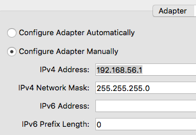
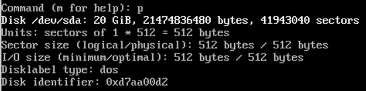
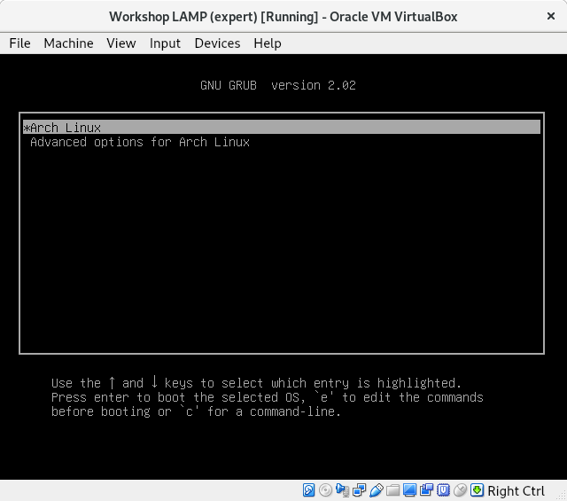

# Inhoudsopgave

1. [Inleiding](#inleiding)
2. [Voorbereiding](#voorbereiding)
3. [Arch Linux](#arch-linux)
4. [SSH en SFTP](#ssh-en-sftp)
6. [MariaDB](#mariadb)
7. [PHP](#php)
8. [Apache](#apache)
7. [Uitbreidingen](#uitbreidingen)
	* [phpMyAdmin](#phpmyadmin)
	* [VirtualBox GuestAdditions](#virtualbox-guestadditions)
	* [Ontbrekende firmware](#ontbrekende-firmware)
	* [Kleuren in console](#kleuren-in-console)

# Inleiding

Tijdens deze workshop gaan we in **VirtualBox** een eenvoudige webserver installeren 
en configureren. Dit gaan we doen door een zogenaamde **LAMP** stack op te zetten. 
LAMP staat voor **Linux – Apache – MariaDB – PHP**. Deze vier technologieën gaan we 
stap voor stap installeren en configureren. Als einddoel hebben we dan een simpele
webserver opgezet in een virtuele omgeving.

Afspraken doorheen deze workshop:
    
* namen van pakketten en belangrijke termen zijn weergegeven in het **vet**
* commando’s zijn weergeven in een kader met voorafgaande command prompt of in-line in **vet**
* acties/selecties/muisklikken worden geplaatst tussen ' '
* toetsenaanslagen worden geplaatst tussen " ", b.v.:&nbsp;"ctrl + c"
* (deel)inhoud van bestanden is in een kader afgedrukt (indien mogelijk met syntaxcoloring)
* enkel de basis installatie wordt als root uitgevoerd. De configuratie nadien 
gebeurt met een gebruiker met sudo rechten
* het is mogelijk om sommige (configuratie)bestanden rechtstreeks te downloaden (Rechtermuisknop -> Link opslaan) i.p.v. de wijzingingen aan te brengen zoals beschreven in de tekst. Controleer zeker of u geen waarden in het bestand nog moet aanpassen indien nodig!

In deze uitgebreidere versie van de workshop wordt er ook meer aandacht besteed 
aan beveiliging van de server door o.a. meerdere gebruikers en partities aan te 
maken.

# Voorbereiding

## Linux distributie downloaden


Als Linux distributie kiezen we voor [**Arch Linux**](https://www.archlinux.org/).
 Deze wordt wegens *bleeding-edge* niet aangeraden voor server installaties maar
 we gebruiken deze omdat we ook de installatiestappen van Linux zelf willen bestuderen.
 Ook wordt deze distributie standaard geïnstalleerd zonder GUI. Download 
[**hier**](https://www.archlinux.org/download/) de laatste versie. Daarnaast heeft deze 
distributie ook een uitgebreide documentatie terug te vinden op 
[**ArchWiki**](https://wiki.archlinux.org/).

## Aanmaken nieuwe virtuele machine

Maak eerst een nieuw host-only network aan. Dit doe je door in **virtualbox** de 
'Host Network Manager' te openen. Kies nadien voor 'create' om een nieuwe adapter aan
 te maken. Stel de waarden in voor deze adapter zoals te zien hieronder.



Maak nu in VirtualBox een nieuwe machine aan met volgende parameters:

* Geheugen: minstens 1024 MB (indien meer mogelijk is dit beter)
* Harde Schijf: 20 GB
* 2 Netwerk Adapters 
	* 1: NAT
	* 2: Host-Only (Kies bij 'name'  de aangemaakte netwerkadapter van hierboven)

# Arch Linux

## Voorbereiding

Start de virtuele machine en kies het ISO bestand van ArchLinux om op te starten.
U krijgt volgend scherm te zien


Aangezien we nog geen besturingssysteem geïnstalleerd hebben kiezen we voor 
'Boot Arch Linux (x86_64)'. Na laden van de installatie komen we in de commandprompt
 terecht en kunnen we starten met de voorbereiding van de installatie.


## Toestenbordindeling instellen

Aangezien standaard de US-indeling geladen wordt zal het toetsenbord dus ook in 
**qwerty** formaat staan. Om over te schakelen naar **azerty** laden we de juiste
 toetsenbord combinatie als volgt: 
   
```bash
root@archiso ~ # loadkeys be-latin1
```

## Controleren of we met het internet verbonden zijn

Tijdens en na de installatie zullen we pakketten moeten downloaden. Daarom moeten
 we zeker zijn dat we verbonden zijn met het internet. Om de verbinding te controleren
 voeren we een **ping** uit naar Google:

```bash
root@archiso ~ # ping www.google.be
```

Gebruik "ctrl + c" om het ping commando te stoppen na enkele gelukte pogingen.

Soms laat de netwerkconfiguratie niet toe om een adres te pingen. Het is dan ook 
steeds een goed idee om via **curl** de netwerktoegang te controleren:

```bash
root@archiso ~ # curl icanhazip.com
```

Als uitvoer van dat commando zou je het externe ip van jouw machine moeten zien
 verschijnen. Indien dat niet zo is heb je geen toegang tot het internet.

## Klok goed zetten	

De initiële waarde van de systeemklok is niet altijd accuraat. Om deze bij te
 stellen voeren we volgend commando uit:

```bash
root@archiso ~ # timedatectl set-ntp true
```

## Harde schijf voorbereiden

Aangezien we een nieuw systeem installeren met een nieuwe harde schijf moeten we
 deze eerst partitioneren zodat we straks **Linux** op een partitie kunnen 
installeren. Om een overzicht te krijgen van de aanwezige harde schijven en hun 
partities voeren we volgend commando uit:

```bash
root@archiso ~ # fdisk -l
```

U zou een uitvoer gelijkaardig aan onderstaande schermafbeelding moeten krijgen:


In deze workshop gaan we verder uit van **/dev/sda** als primaire harde schijf.
Pas in de commando's dus **sda** aan indien u een andere letter heeft voor jouw 
harde schijf. Om effectief partities op onze schijf aan te maken gaan we met **fdisk** aan de 
slag gaan.

```bash
root@archiso ~ # fdisk /dev/sda
```

Het programma om te partitioneren is nu geladen. Via "m" krijgt u een overzicht 
van alle commando's. Dankzij "p" krijg je een overzicht van de huidige partities 
op de geselecteerde harde schijf (bij ons /dev/sda). De uitvoer zou er als volgt 
moeten uitzien:



Controleer zeker of **Disklabel type: dos** is. Indien dat niet zo is voert u 
eerst "o" in als commando om zo een nieuwe partitietabel aan te maken van het type dos.
	
We kiezen er in deze uitgebreide workshop voor om onze schijf in 4 partities op 
te delen.

| Naam partitie | Omschrijving 					 | Bestandstype | Mountpoint |
| :------------ | :----------------------------- | :----------- | :--------- |
| boot			| bevat de bootloader 			 | msdos/fat	| /boot		 |
| root			| bevat de serverprogrammas 	 | ext4			| /			 |
| webserverdata | bevat de data van de webserver | ext4			| /srv/http  |
| swap          |  								 | swap	  	    | -			 |

Er kan eventueel nog gekozen worden om de gebruikersgegevens (**/home**) ook op 
een aparte partitie te plaatsen. In een serveromgeving wordt dit echter bijna nooit
gedaan omdat de grootte van deze map te verwaarlozen is.

Het voordeel van deze manier van werken is dat b.v.: de gegevens de server heel 
gemakkelijk kunnen gemigreerd worden omdat deze op eenzelfde partitie staan.

Om een nieuwe partitie aan te maken voeren we eerst "n" in als commando. 
Nadien drukt u een aantal keer op "enter", controleer steeds of de standaardwaarden
 overeenkomen met de gewenste waarden voor de partities. Maak alle partities aan
volgens de gegevens in onderstaande tabel. De tabel gaat uit van een machine met 1GB
geheugen en 20 GB harde schijf. Indien u meer geheugen genomen heeft, vermindert
u de groote van de tweede partitie (=root) met de extra hoeveelheid geheugen genomen boven 1 GB.
De extra hoeveelheid vermeerder u dan bij de vierder partitie (=swap)

**Voorbeeld:** Indien u 4 GB geheugen nam is de laatste sector van de tweede partitie +9.8G
en de deze van de vierde partitie +4G. In dat geval kloppen ook de waarden van de
eerste sector niet zoals weergegeven in de tabel. U verandert deze dan ook niet en
laat het systeem zelf de waarden invullen.

| Partition type | Partition number | First sector | Last sector |
| :------------: | :--------------: | :----------: | :---------: |
| p              | 1 				| 2048		   | +200MB		 |
| p              | 2 				| 411648	   | +12.8G		 |
| p              | 3 				| 27215872	   | +6G		 |
| p              | 4 				| 39798784	   | +1G	     |
 
Controleer met "p" of de partitietabel goed gemaakt is


Voer nu het commando "a" uit om de partitie **bootable** te maken.
 De BIOS zal immers zoeken naar een opstartbare harde schijf. Selecteer "1" om de eerste partitie (=bios) bootable te maken.


Zoals uit onze partitietabel hierboven af te leiden is, klopt het bestandstype van
de eerste en vierde partitie nog niet. Deze moeten **fat** en **swap** worden.

Voer "t" in om het type van een partitie te wijzigen. Kies de gewenste partitie ("1" of "4")
 en geef dan het nummer in van het gewenste bestandstype ("b" voor boot of "82" voor swap).


Controleer nu een laatste maal met "p" de partitietabel.


Schrijf nu ten slotte alle wijzigingen naar de harde schijf weg met "w". 
Dit sluit ook **fdisk** af. Hierdoor keren we terug naar onze normale command prompt.
Bij het afsluiten krijgt u een bevestiging te zien dat de partitie effectief werd
aangemaakt.


We hebben nu wel een harde schijf met opstartbare aangemaakt maar deze beschikt 
nog niet over een bestandssysteem per partitie. In deze workshop gaan we 
gebruik maken van het **fourth extended file system** ofwel **ext4**. Dit is de 
standaard bestandsindeling voor huidige Linuxdistributies. Maar voor elke partitie
nu de bestandssystemen aan

```bash
root@archiso ~ # mkfs -t vfat /dev/sda1
root@archiso ~ # mkfs.ext4 /dev/sda2
root@archiso ~ # mkfs.ext4 /dev/sda3
root@archiso ~ # mkswap /dev/sda4
```

## Installeren basis ArchLinux

Nu we een geformatteerde harde schijf hebben moeten we eerst de partities **mounten** 
om de installatie verder te zetten. We kunnen enkel (partities op) een harde schijf  
benaderen indien deze gemount is. Hierdoor verwijst het apparaat naar een bepaalde 
map binnen de bestandsstructuuur van **Linux**. Omdat we enkel kunnen mounten naar
een bestaande map zullen ook bepaalde maeppen eerste aangemaakt moeten worden.

```bash
root@archiso ~ # mount /dev/sda2 /mnt
root@archiso ~ # mkdir /mnt/boot
root@archiso ~ # mount /dev/sda1 /mnt/boot
root@archiso ~ # mkdir -p /mnt/srv/http
root@archiso ~ # mount /dev/sda3 /mnt/srv/http
root@archiso ~ # swapon /dev/sda4
```

Nadat we elke partitie gemount hebben kunnen we de basisonderdelen van **Arch Linux**
 hierop installeren. Deze zijn voor deze workshop uitgebreid met een aantal extra
hulpprogramma's die in **base-devel*** zitten

```bash
root@archiso ~ # pacstrap /mnt base base-devel
```

Tijdens de installatie zullen indien nodig eerst recentere pakketten worden gedownload. 
Dit kan dus even duren. Nadat de installatie voltooid is hebben we een basissysteem 
maar dit dient eerst nog verder geconfigureerd te worden alvorens de machine te 
herstarten!

## Fstab genereren

In het bestand **fstab** (in de map /etc) zit een tabel met een overzicht van 
alle apparaten die deel uitmaken van het filesystem. De inhoud kan u bekijken via

```bash
root@archiso ~ # cat /mnt/etc/fstab
```

Op dit moment is dit bestand nog leeg, we moeten onze harde schijf hier dus nog aan toevoegen. 
Dit doen we door volgend commando uit te voeren

```bash
root@archiso ~ # genfstab -U /mnt >> /mnt/etc/fstab
```

Controleer nu de inhoud van **fstab** of er een entry toegevoegd werd voor elke 
partitie op /dev/sda.


Om nu de Arch Linux-installatie zelf verder in te stellen moeten als **root** in het 
nieuwe systeem aanmelden, dit doen we als volgt

```bash
root@archiso ~ # arch-chroot /mnt
```


Merk op dat hierdoor ook de command prompt aangepast werd!

## Tijdzone instellen

De tijdzone stellen we in door een symbolische link aan te maken tussen de gewenste
 tijdzone en **/etc/localtime**. Het volgende commando stelt de tijdzone in als Brussels

```bash
[root@archiso /]# ln -sf /usr/share/zoneinfo/Europe/Brussels /etc/localtime
```

Synchroniseer daarna de tijd met:

```bash
[root@archiso /]# hwclock --systohc
```

Controleer tenslotte of de datum en tijd correct zijn met het commando **date**

## Taal & Regio instellen

We gaan in deze versie van de workshop werken met **locale** **en_US.UTF-8**. 
Open het bestand **/etc/locale.gen** met **nano** of **vi**. Zoek de regel met 
gewenste locale en verwijder de # aan het begin van de regel. Sla de wijzigingen
 in het bestand op (in vi: duw "esc" en voer dan "wq!" in). Genereer nu de locale.

```bash
[root@archiso /]# locale-gen
```

Om de taal (hier **Engels**") in te stellen voer je volgend commando uit

```bash
[root@archiso /]# echo "LANG=en_US.UTF-8" > /etc/locale.conf
```

Het toetsenbord in de console op **azerty** instellen doen we als volgt:

```bash
[root@archiso /]# echo "KEYMAP=be-latin1" > /etc/vconsole.conf
```

## Initramfs

Nu gaan we de bestanden genereren die toelaten dat linux geboot kan worden, de **initial ramdisk** bestanden.

```bash
[root@archiso /]# mkinitcpio -p linux
```

Tijdens het genereren krijgt u een uitvoer gelijkaardig aan onderstaande afbeelding.
 U zal een waarschuwing krijgen dat firmware **aic94xx** en **wd719x** ontbreken. 
Deze waarschuwingen zullen we wegwerken in [Ontbrekende Firmware](#ontbrekende-firmware)
nadat **SSH** en **SFTP** zijn geïnstalleerd en geconfigureerd.


## Wachtwoord instellen

Bij een nieuwe installatie moet ook het wachtwoord voor **root** ingesteld worden. 
Zorg er voor dat u dit gemakkelijk kan onthouden!

```bash
[root@archiso /]# passwd
```

## Hostname instellen

Om er voor te zorgen dat ons netwerk IP-adressen op een juiste manier omzet gaan we een **hostname** instellen. Hiervoor moeten we de bestanden **/etc/hostname** en **/etc/hosts** aanpassen. Indien een andere waarde dan **virtualbox** wil dan vervangt u deze waar nodig.

```bash
[root@archiso /]# echo "virtuallamp" > /etc/hostname
```

Open het bestand **/etc/hosts** met **vi** of **nano** en voeg volgende regels toe:

```bash
127.0.0.1	localhost
::1		localhost
127.0.1.1	virtuallamp.localdomain	virtuallamp
```

## Bootloader

Als laatste stap om de installatie af te ronden moeten we ook een bootloader installeren. Deze zorgt voor de verbinding tussen de **BIOS** en de **initramfs**. Zo krijgen we een menu te zien waaruit we kunnen kiezen welk besturingssysteem we starten. Zonder deze bootloader zal de BIOS geen besturingssysteem vinden om te laden! Wij gaan hiervoor gebruik maken van **grub**. 
**os-prober** zorgt er voor dat eventueel andere besturingssystemen zullen gedecteerd worden.
Deze wordt niet standaard mee geïnstalleerd dus dit doen we als volgt:

```bash
[root@archiso /]# pacman -S grub os-prober
```

**Pacman** is de package manager in Arch Linux. Nu is enkel nog maar het pakket **grub** in Arch Linux geïnstalleerd. We moeten er ook voor zorgen dat de code op onze bootbare harde schijf wordt geplaatst om onze initramfs bestanden te vinden. Hiervoor moeten we grub installeren op de bootbare partitie (/dev/sda1) en nadien configureren. Dit doen we als volgt:

```bash
[root@archiso /]# grub-install /dev/sda
[root@archiso /]# grub-mkconfig -o /boot/grub/grub.cfg
```

Indien de installtie gelukt is kan u de chroot omgeving verlaten met **exit**. Nadien gaan we ook onze harde schijf ontmounten en de virtuele machine afsluiten.

```bash
root@archiso ~ # umount -R /mnt
root@archiso ~ # shutdown -h now
```

Verwijder nu het ISO-bestand van de installatie uit de virtuele cd-rom en start de virtuele machine op. Als alles goed gaat komt u op onderstaand menu terecht



Selecteer de eerste optie 'Arch Linux, with Linux core repo kernel' en als alles goed gaat start Arch Linux volledig op. Nadien krijgt u het aanmeldscherm te zien. Hier kan u als root inloggen. Mocht u toch het Arch Linux boot scherm krijgen, dan heeft u het ISO-bestand nog niet verwijdert. Indien dat zo is selecteert u de optie 'Boot existing OS' en dan zou u wel het bovenstaande scherm moeten krijgen.

**Hierdoor is de installatie van Linux geslaagd MAAR hebben we nog geen netwerk …!**

Netwerk instellen

Via het commando **ip link** krijgen we een overzicht van beschikbare netwerk adapters in ons systeem.


Onze twee netwerkkaarten zijn down (De namen **enp0s3** en **enp0s8** kunnen verschillen!). Dit komt omdat er nog geen service geactiveerd is die ip's uitdeelt, namelijk **dhcpcd**. We moeten deze service dus eerst activeren en opstarten. Vanaf dan zullen bij elke opstart van het systeem onze netwerkkaarten automatisch een ip ontvangen. 

```bash
[root@virtuallamp ~]# systemctl enable dhcpcd
[root@virtuallamp ~]# systemctl start dhcpcd
```

Algemeen kan u steeds volgende commandos's gebruiken bij een systeemservice. Indien u deze commando's niet als root uitvoerd moet u deze steeds via **sudo** uitvoeren!

```bash
# Service activeren
systemctl enable <naam service>
# Service starten
systemctl start <naam service>
# Status opvrangen van een service
systemctl status <naam service>
# Stoppen van een service
systemctl stop <naam service>
```

Via het commando **ip link** kan u nu controleren of de state UP is voor **enp0s3** en **enp0s8**. U controleert ook best de status van de service **dhcpcd**


Herhaal nu ook de commando's, zoals we bij de voorbereiding gedaan hebben, om te controleren of we effectief toegang hebben tot het internet

```bash
[root@virtuallamp ~]# ping www.google.be
[root@virtuallamp ~]# curl icanhazip.com
```

Aangezien we de **host-only** adapter gebruiken om vanuit ons host besturingssysteem de guest te benaderen, zullen we deze een statisch ip geven. Zo kunnen we telkens eenzelfde ip gebruiken in de host browser om de website te testen. Het statische ip, hier **192.168.56.56**, stellen we in op **enp0s8**. Pas in onderstaand commando **enp0s8** indien uw 2de netwerkkaart een andere naam had.

```bash
[root@virtuallamp ~]# ip addr add 192.168.56.56/24 broadcast 192.168.56.255 dev enp0s8
```

Open nu in je host besturingssysteem een terminal/command prompt en voer **ping 192.168.56.56** uit. Indien dit lukt is je guest nog steeds bereikbaar en is de netwerkconfiguratie ook afgerond!

Het nadeel van deze methode is dat de configuratie van het statische ip adres verloren gaat bij afsluiten van de machine. We zouden deze stap dus bij elke boot moeten herhalen, wat heel omslachtig is! 

Om dit op te vangen gaan we een configuratiebestand aanmaken waar de details voor **enp0s8** in opgeslagen zitten zodat het statische ip bij elke boot geladen wordt. Open hiervoor het bestand **/etc/dhcpcd.conf** met **vi** of **nano** en voeg onderaan volgende inhoud toe:

```bash
# Statisch IP voor host-only adapter
interface enp0s8
static ip_address=192.168.56.56/24
static routers=192.168.56.1
```

Sla de wijzigingen op in het bestand. Herstart nu de machine (**reboot**) en voer na inloggen het commando **ip a** uit. Je zou nog altijd 192.168.56.56/24 moeten zien bij enp0s8 en state UP.


**TIP:** om na inloggen een overzicht te krijgen van alle ingeladen services gebruik je

```bash
[root@virtuallamp ~]# systemctl --type=service
```

**EXTRA:** om in je shell telkens kleuren te krijgen bij de uitvoer van ls, volstaat het om volgend commando uit te voeren en nadien opnieuw in te loggen. Dit commando zorgt er voor dat er een **alias** aangemaakt wordt en de standaard uitvoer van **ls** aangepast wordt met syntaxcoloring en in jouw bashprofiel wordt geplaatst.
**ELKE** gebruiker moet dit herhalen indien hij ook standaard coloring wil met ls!

```bash
[root@virtuallamp ~]# echo "alias 'ls'='ls --color=always'" >> ~/.bash_profile
```


Indien je een GUI installeert (komt niet aan bod in deze workshop) en ook in die shell kleuren wilt dan voer je ook onderstaande  command uit.

```bash
[root@virtuallamp ~]# echo "alias 'ls'='ls --color=always'" >> ~/.bashrc
```

## Bijkomende pakketten

Om het werken met de terminal wat te vergemakkelijke installeren we ook de pakketten
**tree** en **vim**. Deze laatste is een verbeterde versie van **vi**.

```bash
[root@virtuallamp ~]# pacman -S tree vim
```

## Standaardgebruiker aanmaken

Na deze paragraaf werken we niet langer meer met de **root** user. Alle commando's
zullen door een **normale** gebruiker uitgevoerd worden in **sudo**. Dit zorgt voor
een betere beveiliging op het systeem omdat een gebruiker dan enkel zaken kan wijzigen
indien dit effectief aangegeven wordt. Voer nu onderstaande commando's uit om de
standaardgebruiker aan te maken, vervang de **virtualbox** door een eigen gebruikersnaam
indien gewenst. Ook deze gebruiker krijgt standaard coloring bij ls.

```bash
[root@virtuallamp ~]# useradd -mG wheel virtualbox
[root@virtuallamp ~]# passwd virtualbox
[root@virtuallamp ~]# echo "alias 'ls'='ls --color=always'" >> /home/virtualbox/.bash_profile
```

Het eerste commando zorgt er voor dat de user **virtualbox** wordt aangemaakt en zijn
homemap **/home/virtualbox** gecreëerd wordt. Ook wordt deze gebruiker aan de groep
**wheel** toegevoegd. Deze groep gaan we gebruiker voor onze **sudo** rechten.
Met het tweede commando stellen we het wachtwoord van de gebruiker in.

De gebruiker zit nu wel in een groep **wheel** die we **sudo** rechtne willen toekennen.
Toch moet deze groep eerst nog ingesteld worden als sudogroep. Open het configuratiebestand
met **visudo** en zoek naar de regel **# %wheel ALL=(ALL) ALL. Verwijder de # aan het begin 
de regel en sla het bestand op. Alle gebruikers uit de groep **wheel** hebben nu
toestemming om commando's met **sudo** uit te voeren. Test dit uit als volgt

```bash
# uitloggen als root
[root@virtuallamp ~]# exit
# Log in met de standaardgebruiker
# Gewone gebruiker kan visudo niet uivoeren
[virtualbox@virtuallamp ~]$ visudo 
# Als sudo lukt dit wel
[virtualbox@virtuallamp ~]$ sudo visudo
# Sluit visudo af zonder wijzigingen (met :q)
```

**Aandacht:** het feit dat er een $ op het einde van de commandprompt staat duidt
op het feit dat u normale rechten heeft. Een # toont aan dat u verhoogde rechten heeft.

Hiermee is de installatie van Arch Linux volledig en kunnen we beginnen met het toevoegen van onze server functionatiteiten.

**Nogmaals, vanaf nu wordt nergens nog rechtstreeks met de user root gewerkt!**

# SSH en SFTP

**SSH** (Secure SHell) laat ons toe om vanuit de host in te loggen op de guest en
zo commando's uit te voeren. Het voordeel hiervan is dat we niet meer rechtstreeks
op de virtuele machine zullen werken. Met andere woorden, u kan vanop afstand
een verbinding maken met de machine. Deze kan daarna gerust op een andere (fysieke) locatie
zich bevinden.

## Installatie 

**SSH** is een service (deamon) en zal dus moeten toegevoegd en nadien geactiveerd worden.
Wij kiezen voor **openssh** als pakket om deze service te verzorgen.

Log eerst, indien nodig, in als **standaardgebruiker**

```bash
[virtualbox@virtuallamp ~]$ sudo pacman -S openssh
[virtualbox@virtuallamp ~]$ sudo systemctl enable sshd
[virtualbox@virtuallamp ~]$ sudo systemctl start sshd
[virtualbox@virtuallamp ~]$ sudo systemctl status sshd
```

## Configuratie

We hebben nu wel **SSH** geactiveerd maar nog niet ingesteld dat onze standaardgebruiker
deze service mag gebruiken. Open hiervoor het bestand **/etc/ssh/sshd_config** met **vim** of **nano**
als **sudo**. Zoek naar de regel **#Port 22**. Verwijder de # aan de start van de regel.
het is ook aan te raden om het poortnummer in te stellen op een ander nummer. Dit op 22 laten 
staan zorgt voor een groter beveiligingsrisico omdat dit de standaard poort is van deze service.
het is echter aan te raden een getal groter dan 1024 te nemen, b.v.: **22222**.
Ga vervolgens op zoek naar de regel **#Banner none** en wijzig deze naar **Banner /etc/issue**.
Als laatste wijziging voeg je onderaan in het bestand volgende regel toe:
**AllowUsers virtualbox**. Deze zorgt er voor dat onze standaardgebruiker toegang
krijgt om via SSH te verbinden met de virtuele machine. Bewaar nu de wijzigingen in het bestand
en herstart de service **sshd**. Controleer de status!

Nu **SSH** correct is ingesteld gaan we proberen een verbinding te maken vanuit de host. 

Indien uw hostsysteem **Windows** is kan u gebruik maken van een toepassing **putty**. 
Dit kan u [**hier**](https://www.putty.org/) downloaden. Open de toepassing en vul **192.168.56.56** in bij host
en **22222** bij port. Duw dan op 'ok' en als alles goed gaat krijgt u nu de vraag
om uw gebruikersnaam in te geven en wachtwoord. Nadien bent u als standaardgebruiker ingelogd
en krijgt u bijhordende commandt prompt te zien.

## TODO screenshot van putty uit windows!!!

Als u **Linux** of **MacOs** als host gebruikt kan u proberen een connectie te 
maken vanuit de terminal met het commando **ssh virtualbox@192.168.56.56 -p 22222**

Accepteer de boodschap i.v.m. keys. Na invoeren van het wachtwoord komt u in de command
prompt van de server terecht.


U kan vanaf nu kiezen: ofwel logt u in op de virtuele machine en voert u de commando's
daar in de terminal uit. U kan ook opteren om vanuit de host via **SSH** te verbinden
en via deze command prompt te werken. In de kaders met instructie in deze handleiding
zal u **geen** verschil merken omdat de command prompt er in beide gevallen hetzelfde
zal uitzien!

## SFTP

**SFTP** (Secure File Transfer Protocol) zal er voor zorgen dat we vanuit de host
met een FTP-client bestanden kunnen opladen naar de server. Dit is vooral handig
om (configuratie)bestanden op een eenvoudige manier op de server te plaatsen
zonder deze manueel te moeten typen en aanpasssen op de server zelf. Door **openssh**
te installeren en configuren kunnen we ook gebruik maken van **SFTP**. We moeten 
dus geen aparte **FTP** server opzetten zoals in de basis workshop wel het geval was!

### Verbinden

Om via **SFTP** te verbinden vanuit de host moeten we gebruik maken van een FTP-client.
Wij kiezen voor [**FileZilla**](http://filezilla-project.org). Open het programma na installatie 
en ga naar 'File' -> 'Site Manager ...' of via "Ctrl + S". Voeg een 'New Site' toe en vul de gegevens aan.


Via 'Connect' zal er dan een verbinding gemaakt worden. Accepteer ook hier eerst
de ongekende sleutel. Indien de verbinding succesvol tot stand is gebracht komen
 we in de **home** map uit van onze standaardgebruiker.


# MariaDB 

Aangezien onze webserver een **PHP** applicatie zal draaien die een databank (**MySQL**) gebruikt zullen we eerst de databank installeren en configureren, nadien volgt PHP.

## Installatie

Om **MariaDB** te installeren loggen we, indien nodig, eerst in onze distribute in als **standaardgebruiker**. Na inloggen voeren we de installatie uit met onderstaande commando.

```bash
[virtualbox@virtuallamp ~]# sudo pacman -S mariadb
```

Nu MariaDB geïnstalleerd is moeten we ook de mappen aanmaken waarin onze databank zijn data zal opslaan. 

```bash
[virtualbox@virtuallamp ~]# sudo mysql_install_db --user=mysql --basedir=/usr --datadir=/var/lib/mysql
```

Net zoals bij een nieuwe Linux installatie het geval was, is ook bij MySQL het wachtwoord na installatie leeg. Dit moet dus eerst ingesteld worden maar dit is enkel mogelijk als **MariaDB** zelf draait. We hebben op dit moment enkel de installatie gedaan maar net zoals bij **dhcpcd** het geval was draait de service nog niet.

```bash
[virtualbox@virtuallamp ~]# sudo systemctl enable mariadb
[virtualbox@virtuallamp ~]# sudo systemctl start mariadb
```

Controleer of het starten effectief gelukt is en de service MariaDB correct draait. 

```bash
[virtualbox@virtuallamp ~]# sudo systemctl status mariadb
```


## Configuratie

Nu onze service draait kunnen we dus ook het wachtwoord voor de mysql rootgebruiker aanpassen. Voer hiervoor **mysql_secure_installtion** uit. Het huidige wachtwoord is leeg dus duw bij de eerste vraag op "enter". Antwoord nadien op elke vraag met "Y" en voer indien gevraagd het gewenste nieuwe wachtwoord in. Door overal met "Y" op te antwoorden hebben we er  ook voor gezorgd dat de **root** user enkel op de machine (= localhost) kan inloggen op de databank. Hij kan dus niet via **phpMyAdmin** vanuit de host verbinden.

## Testdatabank aanmaken

Nu de configuratie van MariaDB zelf voltooid is kunnen we onze databank aanmaken die we zullen gebruiken voor onze webapplicatie. Log hiervoor eerst in bij mysql met de user root met het commando **mysql -u root -p**
Voer bij het wachtwoord dit van mysql in, het wachtwoord dat je in vorige paragraaf hebt ingesteld, EN NIET jouw eigen root wachtwoord! 

Indien je succesvol aangemeld bent zal de prompt er uitzien als **MariaDB [(none)]**. Voer ondertaande commando's één voor één uit om de testdatabank aan te maken
Het voordeel van nu verbonden te zijn via **SSH** is dat je tekst kan plakken in de command prompt. Zo hoeft u niet alles over te typen
maar kan u via 'copy' en 'paste' (= rechter muis knop) de tekst overbrengen.

```sql
MariaDB [(none)] create database test;
MariaDB [(none)] use test;
MariaDB [(test)] CREATE TABLE user (name VARCHAR(50) NOT NULL, PRIMARY KEY (name));
MariaDB [(test)] insert into user values ('Jan');
MariaDB [(test)] insert into user values ('Bert');
MariaDB [(test)] insert into user values ('Pieter');
MariaDB [(test)] insert into user values ('Tom');
MariaDB [(test)] insert into user values ('Stijn');
MariaDB [(test)] select * from user order by name;
```

Als u na het laatste commando onderstaande uitvoer krijgt is de testdatabank klaar:


## Testgebruiker aanmaken

Om onze databank beter af te schermen gaan we nu nog twee gebruikers aanmaken in **MariaDB**.
De ene gebruiker **testadmin** zal via **phpMyAdmin** toegang krijgen tot de databank **test** en de mogelijkheid hebben de databank te wijzigen.
Daarnaast maken we ook een gebruiker **testdata** aan die enkel via de webserver (= localhost) toegang zal hebben tot de databank en waarbij zijn
toegang beperkt is  tot het uitvoeren van **select, insert, update of delete** queries en dus  geen beheer van de databank zelf.

```sql
MariaDB [(test)] CREATE USER IF NOT EXISTS 'testadmin'@'192.168.56.%' IDENTIFIED BY 'vul hier uw passwoord in');
MariaDB [(test)] GRANT ALL PRIVILEGES ON test.* TO 'testadmin'@'192.168.56.%';
MariaDB [(test)] SHOW GRANTS FOR 'testadmin'@'192.168.56.%';
MariaDB [(test)] CREATE USER IF NOT EXISTS 'testdata'@'localhost' IDENTIFIED BY 'vul hier uw passwoord in');
MariaDB [(test)] GRANT SELECT,INSERT,DELETE,UPDATE ON test.* TO 'testdata'@'localhost';
MariaDB [(test)] SHOW GRANTS FOR 'testdata'@'localhost';
```


Verlaat mariadb via **exit** en u keert terug naar de prompt van de standaardgebruiker.
Hiermee is de installatie en configuratie voor MariaDB klaar. 

Probeer nu in **MariaDB** in te loggen met **testdata** en **testadmin**. 
Verbinden als **testdata** zal enkel lukken indien ook de databank **test** werd meegeven in het commando

```bash
[virtualbox@virtuallamp ~]$ mysql test -u testdata -p
```

Het is immers de enigste databank waarvoor hij rechten heeft. Verbinden als **testadmin** mag niet lukken omdat deze geen rechten heeft om via **localhost** te verbinden. Deze kan enkel verbinden via **phpMyAdmin**.

**EXTRA:** om niet altijd alle SQL queries via command prompt te moeten ingeven kan je ook het pakket **phpMyAdmin** installeren om via de browser op de host jouw databank te beheren (zie [Uitbreidingen](#uitbreidingen)).
Via **phpMyAdmin** zal de gebruiker **testadmin** wel kunnen verbinden met de databank **test** om deze te beheren.

# PHP

De volgende stap is om **PHP** te installeren. PHP is een eenvoudig aan te leren scripttaal waarbij we serverside inhoud kunnen genereren om zo onze HTML pagina's verrijken.

## Installatie

Om PHP te installeren loggen we, indien nodig, eerst in onze distribute in als **standaardgebruiker**. Nadien installeren we PHP als volgt:    

```bash
[virtualbox@virtuallamp ~]$ sudo pacman -S php
```

## Configuratie

Nu PHP geïnstalleerd is moeten we ook een aantal zaken gaan configureren. PHP is geen service zoals **MariaDB** of **Apache** en moet dus ook niet geactiveerd worden. Standaard zijn echter heel wat uitbreidingen niet geactiveerd. Aangezien wij via PHP onze MySQL databank wensen te bevragen zullen wij deze functionaliteit moeten activeren. Dit doen door het bestand **/etc/php/php.ini aan te passen**. Open het bestand met **vim** of **nano** en zoek naar de regel **;extension=pdo_mysql** en verwijder de ; aan het begin van de regel om deze extensie te activeren. Sla de wijzigingen in het bestand op. Controleer nu of het bestand **pdo_mysql.so** aanwezig is in de map **/usr/lib/php/modules/**

**TIP:** Het kan ook handig zijn om **display errors = on** in **/etc/php/php.ini** te plaatsen. Deze staat nu nog op 'off'. Indien deze 'on' staat zullen eventuele fouten in de PHP pagina getoond worden in de browser. Indien deze waarde op off staat zal er bij fouten enkel een witte pagina getoond worden. De waarde 'on' is dus enkel nuttig voor ontwikkelomgevingen. In productie staat deze waarde op 'off'

**AANDACHT:** Elke wijziging in php.ini zorgt er voor dat de Apache server moet herstart worden (zie [Apache](#apache)).

Hiermee zit de installatie en configuratie voor PHP er op.

# Apache

Als laatste stap om onze **LAMP** stack te vervolledigen gaan **Apache** installeren. Hierop zullen wij dan een webapplicatie draaien bestaande uit twee eenvoudige PHP pagina's om aan te tonen dat PHP effectief draait en we data uit onze testdatabank kunnen ophalen.

## Installatie

Om Apache te installeren loggen we, indien nodig, eerst in onze distribute in als root. We installeren naast **Apache** ook al onmiddellijk de uitbreiding voor PHP mee. Na inloggen voeren we in de commandprompt het volgende uit.

```bash
[virtualbox@virtuallamp ~]$ sudo pacman -S apache php-apache
```

Net zoals bij MariaDB het geval was, moeten we ook Apache als service activeren en starten. Merk op dat de naam van de service niet **Apache** is maar **httpd**!

```bash
[virtualbox@virtuallamp ~]$ sudo systemctl enable httpd
[virtualbox@virtuallamp ~]$ sudo systemctl start httpd
[virtualbox@virtuallamp ~]$ sudo systemctl status httpd
```

Onze **Apache** webserver draait nu. Dit betekent dat we via een browser in ons host besturingssysteem naar http://192.168.56.56 kunnen surfen en zo de indexpagina van onze wesbite bereiken. Test dit nu uit!


## Configuratie

Nu onze service draait gaan we deze verder configureren zodat we PHP pagina's kunnen laden. Het eerste wat we moeten instellen is de locatie waar de bestanden van onze website zullen komen. Dit doen we door het bestand **/etc/httpd/conf/httpd.conf** aan te passen, dus open dit bestand via **vim** of **nano**. Zoek naar volgende regels:

```bash
LoadModule mpm_event_module modules/mod_mpm_event.so
#LoadModule mpm_prefork_module modules/mod_mpm_prefork.so
``` 

Verplaats nu de **#** van de regel met prefork naar de regel met event. We willen immers de **mpm_prefork_module** gebruiken omdat deze beter overweg kan met threading bij PHP.

Zoek ook naar de regel **#LoadModule rewrite_module modules/mod_rewrite.so** en verwijder de # aan het begin van de regel. Dit zal ons toelaten om later via een .htaccess bestand redirects uit te voeren in webpagina's.

Voer onder de laatste #loadmodule regel volgende regels specifiek voor **PHP** toe. Meerdere regels plakken in **vim** doet u met "Ctrl + Shift + v"

```bash
LoadModule php7_module modules/libphp7.so
AddHandler php7-script .php
```

Zoek nu verder naar de regels:

```bash
DocumentRoot "/srv/http"
<Directory "/srv/http">
```

Pas de inhoud inhoud als volgt

```bash
DocumentRoot "/srv/http"

<Directory "/srv/http">
	# Enkel toelaten dat andere pagina's gebruikt worden
	Options FollowSymLinks
	# Speciale instellingen via .htaccess  toelaten
	AllowOverride all
	# Geen toegang zonder rechten
	Require all Granted
</Directory>
```

Zoek nu naar de regels:

```bash
<IfModule dir_module>
	DirectoryIndex index.html
</IfModule
```

Voeg na index.html ook de tekst index.php toe.

Zoek nu naar de regel **#Include conf/extra/httpd-vhosts.conf** en verwijder de # aan het begin van de regel.
Dit laat ons toe om meerdere webapplicaties op eenzelfde server te hosten.

Ga nu helemaal naar onder in het bestand en voeg volgende regels toe specifiek voor **PHP 7**:

```bash
# PHP 7
Include conf/extra/php7_module.conf
```

Sla de wijzigen op in het bestand. Controleer of de syntax juist is met **apachectl configtest** en herstart nu de httpd service met **systemctl restart httpd**. Controleer steeds na het herstarten van een service zijn status!
Indien u nu de browser van je host naar http://192.168.56.56 surft krijgt u niet langer de indexpagina te zien maar een **403** fout dat u geen toegang heeft.


Aangezien we de optie aangezet hebben om meerdere applicatie te hosten op onze 
webserver gaan we nu een **virtual host** toevoegen voor onze testapplicatie. Open het bestand **/etc/httpd/conf/extra/httpd-vhosts.conf** met **vim** of **nano** of download het gewijzigde bestand [hier](./files/httpd-vhosts.conf). Plaats volgende inhoud in het bestand waarmee de huidige virtual hosts die als voorbeeld gedefinieerd werden zullen overschreven worden.
 
**httpd-vhosts.conf** ([Downloaden](./files/httpd-vhosts.conf)) 
```bash
<VirtualHost *:80>
    ServerAdmin webmaster@virtuallamp.com
    DocumentRoot "/srv/http/test"
    ServerName www.virtuallamp.com
    ErrorLog "/var/log/httpd/virtuallamp.com-error_log"
</VirtualHost>
```

Herstart nu de httpd service met **systemctl restart httpd**. Controleer steeds na het herstarten van een service zijn status!
Open nu de pagina in de host en u zal niet langer een **403** (= geen rechten) maar een **404** (= pagina niet gevonden) fout krijgen. Dit komt omdat de map test en bijhorende pagina's nog niet bestaan.


## Testpagina's toevoegen

Als laatste stap gaan we nu twee php pagina's toevoegen op onze website en een **.htaccess** bestand. Zoals uit vorige paragraaf bleek moeten we deze bestanden aan de **/srv/http** map toevoegen. Deze bestat echter nog niet, dus maak deze aan met **sudo** rechten.

```bash
[virtualbox@virtuallamp ~]$ sudo mkdir /srv/http/test
```

Maak nu in jouw host besturingssysteem volgende bestanden aan met weergegeven inhoud. Upload telkens elke bestand via SFTP naar jouw homemap. Vandaar verplaatst u het bestand, via de command prompt, naar **srv/http/test/** d.m.v. **sudo** rechten.

**index.php** ([Downloaden](./files/index.php))

```php
<?php phpinfo(); ?>
```

Open nu op de host jouw browser opnieuw en surf naar http://192.168.56.56 Indien alles gelukt is ziet u de informatie pagina van PHP zoals hieronder


Indien dit zo is dan is de integratie van PHP met Apache gelukt. Mocht dit toch niet zo zijn en u krijgt een foutpagina **500** te zien dan zal dit waarschijnlijk aan de rechten liggen van de bestanden.
PHP bestanden moeten immers kunnen uitgevoerd worden. Controller of de rechten ingesteld staan als **rwxrwxr-x" op index.php in /srv/http/test. Pas deze aan indien dat niet zo was

```bash
[virtualbox@virtuallamp ~]$ sudo chmod 775 *.php
```

Probeer het nu opnieuw. Nu zou het wel moeten lukken om de pagina te zien. Anders zal u wellicht ergens een syntaxfout gemaakt hebben. Schakel **display_errors** aan in **/etc/php/php/ini** en probeer zo verder te debuggen.

**databank.php** ([Downloaden](./files/databank.php))

```php
<?php
// De details voor connectie met databank
$DB_host = "localhost";
$DB_port = "3306";
$DB_user = "testdata";
$DB_password = "VUL DIT AAN MET JOUW WACHTWOORD VOOR TESTDATA";
$DB_name = "test";

// Proberen om een databank connectie op te zetten
try
{
    $DB_con = new PDO("mysql:host=$DB_host:$DB_port;dbname=$DB_name",$DB_user,$DB_password);
    $DB_con->setAttribute(PDO::ATTR_ERRMODE, PDO::ERRMODE_EXCEPTION);
}
catch(PDOException $e)
{
    echo $e->getMessage();
}

try {
    // alle testusers ophalen 
    $sql = "SELECT * FROM user ORDER BY name";
    $stmt = $DB_con->prepare($sql); 
    $stmt->execute();
    // De resultaten van de query afdrukken in onze pagina
    $gebruikers = $stmt->fetchAll();
    print_r($gebruikers);
} 
catch (PDOException $e) {
    echo $e->getMessage();
}

?>
```

Upload ook dit bestand naar je server en plaats het in **/srv/http/test/**. Ga nu in de browser van je host naar http://192.168.56.56/databank.php en u zou een overzicht van de gebruikers moeten zien als volgt:


Dit betekent dat we onze MySQL databank kunnen aanspreken vanuit PHP op onze Apache webserver. Hiermee is onze LAMP stack opgezet!!

**EXTRA:** om onze server mooier af te schermen tegen foute URL's gaan we een .htaccess bestand gebruiken. Dit zorgt er voor dat bij een Apache paginafout 403, 404, of 500 de gebruiker doorverwezen wordt naar de indexpagina.

**.htaccess** ([Downloaden](./files/.htaccess))

```bash
ErrorDocument 403 /index.php
ErrorDocument 404 /index.php
ErrorDocument 500 /index.php

RewriteEngine On
	RewriteCond %{REQUEST_FILENAME} !-f
	RewriteRule ^(.*)$ /index.php
```

Upload ook dit bestand naar je server en plaats het in **/srv/http/test/**. Herstart opnieuw de **httpd** service en probeer nu een pagina te bereiken die niet bestaat, b.v.: http://192.168.56.56/fout.php. U zou nu naar de indexpagina moeten worden omgeleid.

# Uitbreidingen

## phpMyAdmin

Om het beheer van de databank te vergemakkelijken en dus zo het gebruik van **MySQL** prompt zoveel mogelijk te vermijden zullen we gebruik maken van het pakket **phpMyAdmin**. Dit zal ons in staat stellen om via een browser op de host omgeving de databank aan te spreken in de virtualbox en deze te beheren.

### Installatie

Indien nodig log je als **standaardgebruiker** in de virtuele machine in. Voer de installatie uit met het commando

```bash
[virtualbox@virtuallamp ~]$ sudo pacman -S phpmyadmin
```

Aangezien deze uitbreiding, zoals de naam al aangeeft, gebruik zal maken van PHP moeten we ook de extensie activeren om met **mysqli** te werken. Open het bestand **/etc/php/php.ini** in **vim** of **nano** en zoek naar de regel **;extension=mysli** en verwijder de ; op het begin van deze regel.

### Configuratie

Nu de extensie ingeschakeld is moeten we ook in **Apache** een directory toevoegen die verwijst naar de **phpMyAdmin** bestanden. Om dit te doen openen we het bestand **/etc/httpd/conf/httpd.conf** in **vim** of **nano**. Zoek naar de **Include** regel van PHP7 (zie [PHP](#php)) en voeg daaronder volgende regels toe:

```bash
# phpMyAdmin
Include conf/extra/phpmyadmin.conf
```

Aangezien dit bestand **/etc/httpd/conf/extra/phpmyadmin.conf** nog niet bestaat gaan we dit nu aanmaken. Open nadien het bestand met **vi** of **nano** en voeg volgende inhoud toe:

**phpmyadmin.conf** ([Downloaden](./files/phpmyadmin.conf))

```bash
Alias /phpmyadmin "/usr/share/webapps/phpMyAdmin"
<Directory "/usr/share/webapps/phpMyAdmin">
    DirectoryIndex index.php
    AllowOverride All
    Options FollowSymlinks
    Require all granted
</Directory>
```

Dit zal er voorzorgen dat we via http://192.168.56.56/phpmyadmin de applicatie kunnen bereiken dankzij de alias die we gedefinieerd hebben. Alvorens dit zo is moeten we uiteraard eerst onze **httpd** service herstarten

```bash
[virtualbox@virtuallamp ~]$ sudo systemctl restart httpd
[virtualbox@virtuallamp ~]$ sudo systemctl status httpd
```

Bij syntaxfouten in het configuratiebestand zal de service niet goed gestart zijn! Indien het lukt om te pagina te laden krijgt u onderstaand scherm te zien:


Probeer op deze startpagina als root in te loggen met uw **mysql wachtwoord**. Na aanmelden krijgt u volgend dashboard te zien
 


Probeer nadien ook even in te loggen als **testadmin**. Dit zou nu ook moeten lukken. Hierdoor is de installatie van **phpMyAdmin** geslaagd. Links in de boomstructuur kan u de aangemaakte database test terugvinden. Als u deze openklapt kan u de tabel user terugvinden en eventueel aanpassen.

## VirtualBox GuestAdditions

Het installeren van de **GuestAdditions** zal ons toelaten een paar extra zaken te gebruiken zoals onder andere gedeelde mappen en een gedeeld klembord. Dit kan handig zijn om tekst vanuit een host te kunnen plakken in de guest.

### Installatie

Indien nodig, log in als root. Voer daarna de installatie uit.

```bash
[virtualbox@virtuallamp ~]$ sudo pacman -S virtualbox-guest-modules-arch
[virtualbox@virtuallamp ~]$ sudo pacman -S virtualbox-guest-utils
[virtualbox@virtuallamp ~]$ sudo systemctl enable vboxservice
[virtualbox@virtuallamp ~]$ sudo systemctl start vboxservicev
[virtualbox@virtuallamp ~]$ sudo systemctl status vboxservice
```

### Gedeelde map

Indien u een gedeelde map wil gebruiken moet u nu eerst de virtuele machine afsluiten (**shutdown -h now**). Open de instellingen van de server in VirtualBox en ga naar 'shared folders'. Voeg hier een nieuwe map toe die je wil delen. Zorg er zeker voor dat de optie auto-mount aangevinkt werd en dat de naam **GEEN** spaties bevat. Start nu de machine opnieuw op en log in. In de map **/media** zou nu een map moeten zien met als naam **sf_<naam gedeelde map>**

## Ontbrekende firmware

Met deze uitbreiding zullen we de waarschuwing bij het aanmaken van de initramfs wegwerken door de firmware voor **aic94xx** en **wd719x** te installeren.
Download de tars met firmwares [hier](https://aur.archlinux.org/cgit/aur.git/snapshot/aic94xx-firmware.tar.gz) en [hier](https://aur.archlinux.org/cgit/aur.git/snapshot/wd719x-firmware.tar.gz).
Upload deze tars nu naar jouw server en voer onderstaande instructies uit

```bash
[virtualbox@virtuallamp ~]$ tar xvf aic94xx-firmware.tar.gz
[virtualbox@virtuallamp ~]$ cd aic94xx-firmware
[virtualbox@virtuallamp ~]$ makepkg -i
# lha is nodig voor wd719x-firmware, dus pakket installeren
[virtualbox@virtuallamp ~]$ sudo pacman -S lha
[virtualbox@virtuallamp ~]$ tar xvf wd719x-firmware.tar.gz
[virtualbox@virtuallamp ~]$ cd wd719x-firmware
[virtualbox@virtuallamp ~]$ makepkg -i
[virtualbox@virtuallamp ~]$ sudo mkinitcpio -p linux
```

Als alles goed gaat zouden nu de waarschuwingen tijdens het genereren van de initramfs moeten verdwenen zijn.
Indien het gelukt is kan u ook de tars de mappen van de tars in u homemap verwijderen.

```bash
[virtualbox@virtuallamp ~]$ rm *-firmware.tar.gz
[virtualbox@virtuallamp ~]$ rm -rf *-firmware
```

## Kleuren in console

Met deze laatste uitbreidinge zullen we er voor zorgen dat de command prompt en uitvoer van bepaalde commando's voor iedereen gebruik kan maken van syntaxcoloring. We maken eerste een backup van het huidige bashrc bestand zodat we indien nodig dit later kunnen terugzetten

```bash
# kopie maken lokale bashrc (Geeft error indien bestand niet bestond, te negeren)
# Indien er meerdere gebruikers zijn, voor elke gebruiker herhalen
[virtualbox@virtuallamp ~]$ sudo cp ~/.bashrc ~/.bashrc.bak
# Kopie maken van algemene template
[virtualbox@virtuallamp ~]$ sudo cp /etc/bash.bashrc /etc/bash.bashrc.bak
```

Plaats nu de bestanden [bash.bashrc](./files/bash.bashrc), [DIR_COLORS](./files/DIR_COLORS) en [inputrc](./files/inputrc) in de map **/etc**. Log daarna uit als gebruiker. Vanaf nu zal elke bestaande gebruiker die inlogt, of elke nieuwe aangemaakte gebruiker, dit template gebruiken.
